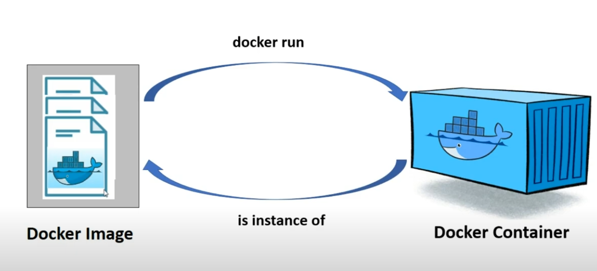

# docker_tutorial
创建一个简单的python app 让便大家更好的了解docker

#### 准备工作, 先安装好docker desktop(请看下面的youtube 安装教程)
https://www.youtube.com/watch?v=ZyBBv1JmnWQ 

#### 1. docker file 的格式

#### 2. create Dockerfile
[docker file](./Dockerfile)

#### 3. build image by running command below
`
docker build -t <give a image name yourself> .(there is dot, don't forget to add it, it means use all files in current directory to build docker image)
`

#### 4. to run your image in docker container
`
docker run --name <give your container a name yourself> <image name you created on step 3 above>
`

#### 5. if you go to your docker desktop, you should see image created by yourself
(Mine is called docker_tutorial as i use command: docker build -t docker_tutorial .)

#### 5.1 you can also see the container too

(my command: docker run --name docker_tutorial_container docker_tutorial)

### Questions: you may ask what's the difference between image and container(common interview question)

* A <b>docker image</b> is a template from which we can create as many containers we want. It's like a cookie cutter(a template to create cookie). 
* Here cookie cutter = docker image. cookie = docker container

* A <b>docker container</b> is the actual place where our application,database, any other software applications runs

### Easier way to improve workflow to manage  docker containers using docker compose (see docker compose file below)
[docker compose file](./docker-compose.yml)

to run file above, use command below it will build docker image and start container using the docker image just built

`
docker-compose up --build
`

as you can in screenshot below, we define two containers(basic_example_container and fastapi_container) in our docker compose file. after running command above,we are able to start multiple containers at once(two in our case). For each container, we have the ability to different dockerfile so that they follow a different docker image(template)

